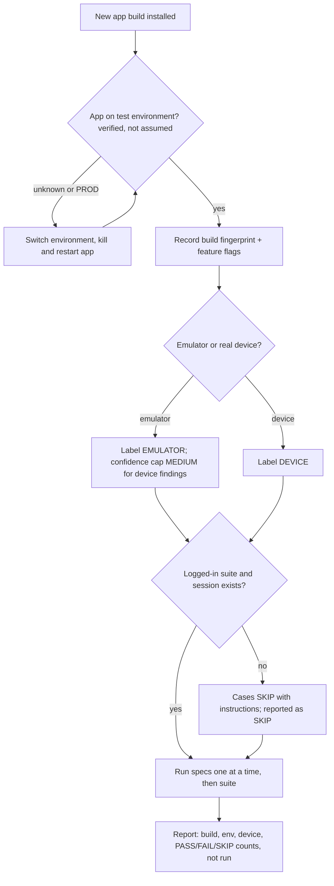

# 06 Mobile run — preconditions and reporting

STATUS: DRAFT, from an earlier project's docs (its code was not run).

```mermaid
flowchart TD
  S[New app build installed] --> E{App on test environment? verified, not assumed}
  E -- unknown or PROD --> SW[Switch environment, kill and restart app] --> E
  E -- yes --> F[Record build fingerprint + feature flags]
  F --> D{Emulator or real device?}
  D -- emulator --> L1[Label EMULATOR; confidence cap MEDIUM for device findings]
  D -- device --> L2[Label DEVICE]
  L1 & L2 --> G{Logged-in suite and session exists?}
  G -- no --> SK[Cases SKIP with instructions; reported as SKIP]
  G -- yes --> RUN[Run specs one at a time, then suite]
  SK --> RUN
  RUN --> REP[Report: build, env, device, PASS/FAIL/SKIP counts, not run]
```
